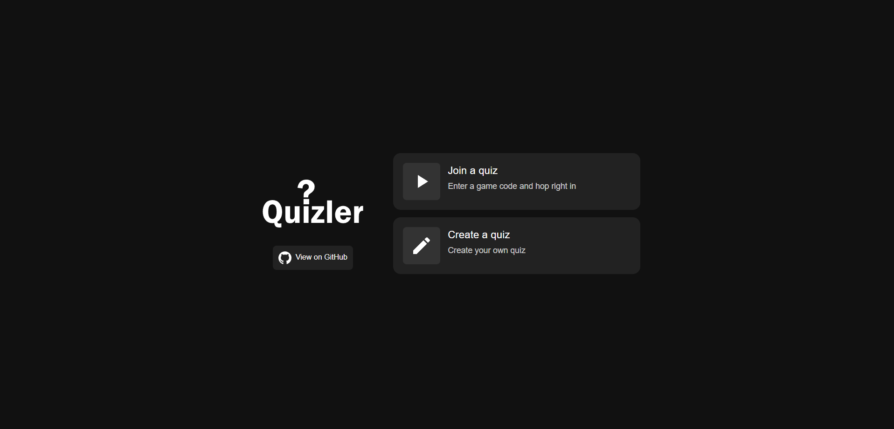
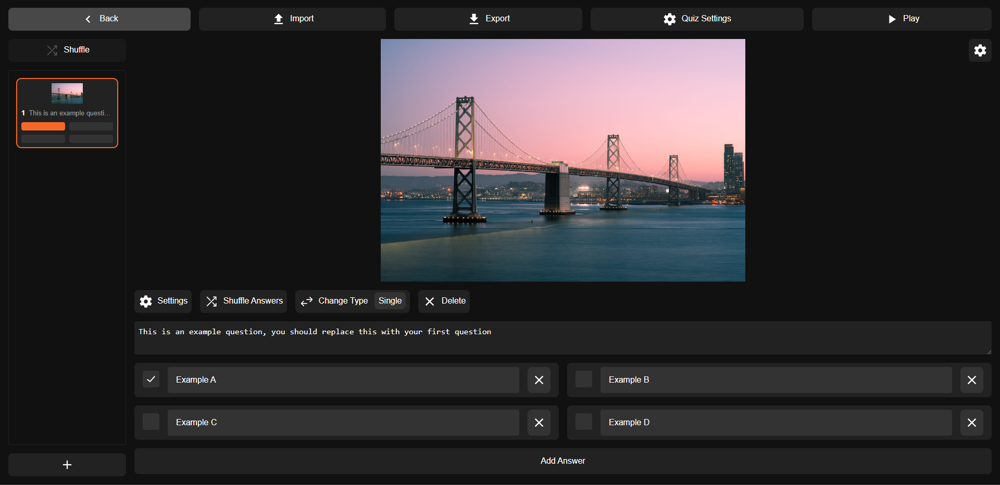
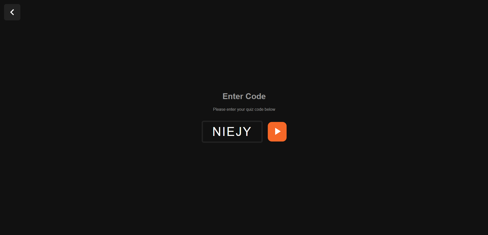

# Quizler


> Real time quiz application

> **Note**
> This project is in early alpha stages, currenlty it is fully functional however all of the features and logic may not be entirely polished yet, this project is under active development


This is the improved version of my [Quizler](https://github.com/jacobtread/Quizler) app which is intended to be a real time quiz application similar to [Kahoot](https://kahoot.com/) but *OpenSource* and able to be played offline over LAN or self hosted.

This version aims to improve upon the downfalls of the previous app (Written in Go) along with providing new features. I aim to make this version more stable and performant using my better understanding of the [Rust](https://www.rust-lang.org/) language.

This new version makes use of [Rust](https://www.rust-lang.org/) for the backend with the [Axum](https://docs.rs/axum/latest/axum/) web framework and [Svelte](https://svelte.dev/) for the frontend. The previous version used [Go](https://go.dev/) for the backend and [VueJS](https://vuejs.org/) for the frontend.

## 🛫 Deploying

Quizler can be quickly and easily deployed to [Render](https://render.com) if you would like to deploy a Free instance to render
you can follow the guide on the Wiki [Here](https://github.com/jacobtread/Quizler-v2/wiki/Deploying-to-Render)


## 📥 Downloads

Prebuilt binaries are available for download here

> **Note**
> This project is still in alpha so there may be unexpected bugs in these early releases

| Platform | Download                                                                                                 |
| -------- | -------------------------------------------------------------------------------------------------------- |
| Windows  | [Download](https://github.com/jacobtread/Quizler-v2/releases/download/v0.1.0-alpha2/quizler-windows.exe) |
| Linux    | [Download](https://github.com/jacobtread/Quizler-v2/releases/download/v0.1.0-alpha2/quizler-linux)       |
<!-- Uncomment when stable releases are out
| Windows  | [Download](https://github.com/jacobtread/Quizler-v2/releases/latest/download/quizler-windows.exe) |
| Linux    | [Download](https://github.com/jacobtread/Quizler-v2/releases/latest/download/quizler-linux)      | 
-->


## 📸 Screenshots

### Home screen

This is the screen which allows the users to select between joining a quiz and
creating their own



### Create screen

This is the screen for creating a new quiz



### Join screen

This is the screen for creating a new quiz




## ⚙️ Features

- [x] Different quesiton types
    - Single: Can have multiple correct answer but only lets the players select one option
    - Multiple: Can have many correct answers and lets the players select more than one answer
- [x] Small and performant, the binary size is super small and is quick to download and move around. From manual testing games could easily handle 15 players in a single game (It can likely handle a far greater number of players however this is untested)
    - Windows binary:  3.8mb 
    - Linux binary: 4.5mb
- [x] Name filtering levels
    - You are able to select different levels of filtering for what usernames are allowed by the players on a quiz by quiz basis (None, Low, Medium, High)
- [x] Image fitting
    - Quiz images can have the fitting property adjusted in order to decide how
    it will be shown on devices (Cover, Contain, Fit Width, Fit Height)
- [x] Customizable timing
    - You can customize the time given for answering on a question by question basis
- [x] Customizable scoring
    - You can customize the min, max, and bonus score awarded for each question
- [x] Easy shuffling
    - There are shuffle buttons for both questions and answers to quickly and easily shuffle the order of questions and answers
- [x] Readyiness and preloading (Automated)
    - The quiz will wait for all the players to preload the images and be "ready" before starting the timer of the question to ensure that players arent at a disadvantage due to slower connections
- [x] Fully portable
  - The server doesn't store any files so its completely portable as a single executable. Quiz's are instead able to be exported and imported as .quizler files which can be shared
  - In future a less portable version might be created that supports storing these files in some sort of database 
- [x] Containerized
  -  Quizler can run both as a single executable or within a Docker container using the `jacobtread/quizler` container image. 
  -  There is an example docker-compose.yml file for starting a dockerized version. 
  -  You can also run a containerize version of the server that builds itself using the Build.Dockerfile docker file
- [x] Short and easy to share codes
  - The quiz codes are short 5 character tokens that cosist of A-Z 0-9 (e.g AZ2ES)
- [x] Cross platform
  - The server can be run on both Windows or Linux, and can be connected to by any device with a web browser (Its recommended that a up to date browser be used as some older browsers might incorrectly render the page) 
  - Any other platform can run the server within a Docker container

## ⚒ Build Instructions

First you must build the frontend as the backend depends on embedding resources created by the frontend build process

> **Note** 
> These commands are from within the context of the repository directory. If you haven't already download the repository and cd to the directory before running the commands below

```shell
# Move to the frontend directory
cd frontend
# Install the dependencies (NPM: npm install)
yarn install
# Run the dist commands (NPM: npm run dist)
yarn dist
# Move out of the frontend directory
cd ..
```
Then you can build the backend

```shell
# Move to the backend directory
cd backend
# Build the release binary
cargo build --release
```

After building the backend the binary will be at
```backend/target/rlease/quizler[.exe]```

If you would like to Build within Docker this repository contains a Build.Dockerfile which does this for you

## 🧾 License

MIT License

Copyright (c) 2023 Jacobtread

Permission is hereby granted, free of charge, to any person obtaining a copy
of this software and associated documentation files (the "Software"), to deal
in the Software without restriction, including without limitation the rights
to use, copy, modify, merge, publish, distribute, sublicense, and/or sell
copies of the Software, and to permit persons to whom the Software is
furnished to do so, subject to the following conditions:

The above copyright notice and this permission notice shall be included in all
copies or substantial portions of the Software.

THE SOFTWARE IS PROVIDED "AS IS", WITHOUT WARRANTY OF ANY KIND, EXPRESS OR
IMPLIED, INCLUDING BUT NOT LIMITED TO THE WARRANTIES OF MERCHANTABILITY,
FITNESS FOR A PARTICULAR PURPOSE AND NONINFRINGEMENT. IN NO EVENT SHALL THE
AUTHORS OR COPYRIGHT HOLDERS BE LIABLE FOR ANY CLAIM, DAMAGES OR OTHER
LIABILITY, WHETHER IN AN ACTION OF CONTRACT, TORT OR OTHERWISE, ARISING FROM,
OUT OF OR IN CONNECTION WITH THE SOFTWARE OR THE USE OR OTHER DEALINGS IN THE
SOFTWARE.
