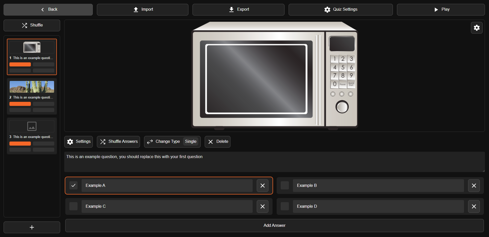

# Quizler


> Real time quiz application

## 📜 Table of Contents

- [🌟 Introduction](#-introduction)
- [📥 Downloads](#-downloads)
- [✨ Features](#-features)
- [📸 Screenshots](#-screenshots)
- [🛫 Deploying](#-deploying)
- [⚙️ Build Instructions](#-build-instructions)
- [🧾 License](#-license)

## 🌟 Introduction 

Welcome to Quizler, an enhanced iteration of the original [Quizler](https://github.com/jacobtread/Quizler-v1) project. It's designed to be a real-time quiz application similar to [Kahoot](https://kahoot.com/), with a focus on being open-source and playable offline over LAN or self-hosted environments.

## 📥 Downloads

Prebuilt binaries are available for download:

| Platform | Link                                                                                           |
| -------- | ---------------------------------------------------------------------------------------------- |
| Windows  | [Download](https://github.com/jacobtread/Quizler/releases/latest/download/quizler-windows.exe) |
| Linux    | [Download](https://github.com/jacobtread/Quizler/releases/latest/download/quizler-linux)       |

## ✨ Features

- **Small and Performant**: Binary sizes for Windows and Linux are optimized, ensuring efficiency without sacrificing performance.
- **Name Filtering**: Maintain a positive environment by customizing the level of filtering for player usernames on a per-quiz basis.
- **Image Fitting**: Adapt quiz images for various devices with options like Cover, Contain, Fit Width, and Fit Height.
- **Customization Options**:
  - Adjust time limits for answering questions.
  - Set min, max, and bonus scores for each question.
  - Support for different question types: Single, Multiple, True/False, and Typer.
- **Easy Shuffling**: Quickly rearrange the order of questions and answers for variety.
- **Readiness and Preloading**: Ensure fairness by waiting for all players to preload images before starting question timers.
- **Fully Portable**: No files are persisted, making Quizler completely portable as a single executable. Quizzes can be exported/imported as self-contained .quizler files.
- **Containerized**: Run Quizler as a standalone executable or within a Docker container using the `jacobtread/quizler` container image. Example `docker-compose.yml` provided.
- **Short and Shareable Codes**: Quiz codes consist of short 5-character tokens (e.g., AZ2ES), making sharing easy.
- **Cross-Platform**: Server runs on both Windows and Linux, accessible from any device with a web browser.

## 📸 Screenshots

### Home screen

Allows users to select between joining a quiz and creating their own.


### Create screen

For creating a new quiz.



### Join screen

For joining a quiz.


## 🛫 Deploying

Easily deploy Quizler to [Render](https://render.com) using the provided guide in the Wiki [Here](https://github.com/jacobtread/Quizler/wiki/Deploying-to-Render). Additionally, it can be deployed to other services that support deploying docker images by using the provided `jacobtread/quizler` docker image or the `Dockerfile` in the repository.

## ⚙️ Build Instructions

Building Quizler requires NodeJS (>=16) for the frontend and Cargo/Rust (>=1.75.0) for the backend:

> **Note** 
> These commands are from within the context of the repository directory. If you haven't already download the repository and cd to the directory before running the commands below

1. **Frontend**:
    ```shell
    # Move to the frontend directory
    cd frontend
    # Install dependencies 
    npm install
    # Run the dist commands
    npm run dist
    # Move out of the frontend directory
    cd ..
    ```

2. **Backend**:
    ```shell
    # Move to the backend directory
    cd backend
    # Build the release binary
    cargo build --release
    ```

After building the backend, find the binary at `backend/target/release/quizler[.exe]`.

For Docker-based builds, refer to the provided `Build.Dockerfile` in the repository, there is also
a docker image for pre-built binaries at `Dockerfile`.

## 🧾 License

MIT License

Copyright (c) 2023 - 2024 Jacobtread

Permission is hereby granted, free of charge, to any person obtaining a copy
of this software and associated documentation files (the "Software"), to deal
in the Software without restriction, including without limitation the rights
to use, copy, modify, merge, publish, distribute, sublicense, and/or sell
copies of the Software, and to permit persons to whom the Software is
furnished to do so, subject to the following conditions:

The above copyright notice and this permission notice shall be included in all
copies or substantial portions of the Software.

THE SOFTWARE IS PROVIDED "AS IS", WITHOUT WARRANTY OF ANY KIND, EXPRESS OR
IMPLIED, INCLUDING BUT NOT LIMITED TO THE WARRANTIES OF MERCHANTABILITY,
FITNESS FOR A PARTICULAR PURPOSE AND NONINFRINGEMENT. IN NO EVENT SHALL THE
AUTHORS OR COPYRIGHT HOLDERS BE LIABLE FOR ANY CLAIM, DAMAGES OR OTHER
LIABILITY, WHETHER IN AN ACTION OF CONTRACT, TORT OR OTHERWISE, ARISING FROM,
OUT OF OR IN CONNECTION WITH THE SOFTWARE OR THE USE OR OTHER DEALINGS IN THE
SOFTWARE.
